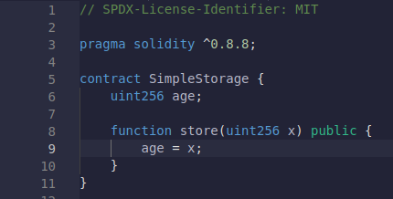
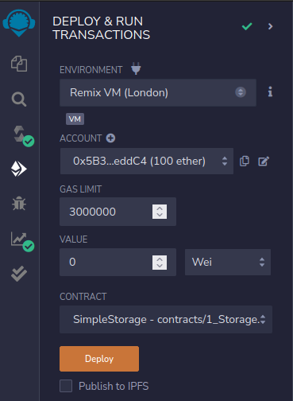
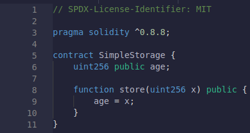

# Remix IDE (Integrated Development Environment)

##

[Remix](https://remix.ethereum.org/)
uma poderosa ferramente de desenvolvimento de codigos gratuitas para trabalhar com Blockchain,
[Remix](https://remix.ethereum.org/)
permite que vejamos é interagirmos com nossos contratos, sem sombra de duvidas uma fatastica forma de aprendermos a os fundamentos de
[Solidity](https://docs.soliditylang.org/en/v0.8.15/),
 mais a frente falaremos também do
[OpenZeppelin](https://www.openzeppelin.com/)
 outra grande aliado nessa nossa jornada.

##

# Introdução

##

* [Remix](https://remix.ethereum.org/)
* [Solidity](https://docs.soliditylang.org/en/v0.8.15/)

##

# Welcome to Remix IDE
##

Aqui é o local onde iremos começar o nosso trabalho com solidity é smart contracts e o seu deploy na Blockchain.
Vamos criar um pequeno contrato que pode armazenar informações na Blockchain.
então vamos criar um novo arquivo (.sol)

Vamos utilizar Remix VM que irá fazer uma simulação de implementação em uma rede test ou na rede real. Na verdade, não iremos fazer um deploy na rede real, mas falaremos disso um pouco mais a frente, por enquanto iremos só começar a trabalhar com a VM Javascript, que é meio que um ambiente falso por enquanto.

Testaremos localmente e entederemoos como testar localmente tornará a experiencia de uma codigo muito mais rapida.

Pois quando enviamos algumas transações, algumas podem demorar para serem implantadas na rede, é não queremos que esses testes levem tempo de mais para serem executados.
##

# Solidity Version && License

Primeiro vamos criar um novo contrato, é iremos definir a sua licença.

A confiaça nos smart contracts podem ser melhor estabelecidas se o codigo fonte estiver disponivel, Como a disponibilização do código-fonte sempre abordar problemas legais em relação a direitos autorais, o compilador Solidity não apenas incentivao uso dos indentificadores como também deve todo smart contract deve começar com a licença o comentário indicando a sua licença: [SPDX-License-Identifier](https://spdx.dev/)
##
`// SPDX-License-Identifier: MIT`.

Caso não deseje utilizar mesmo assim ele deve conter

`// SPDX-License-Identifier: UNLICENSED`
##

Após definirmos a licença no contrato a primeira coisa que iremos fazer é definir a versão que iremos utilizar para trabalhar é ela devera ser posicionada após a licença como a primeiro objeto no nosso contrato.

Como Solidity é uma linguagem relativamente nova é esta em constante a atualizando, devemos declarar a versão da sequintes maneira.

Dessaforma iremos utilizar qualquer versão igual ou maior que `0.6.0` é menor que `0.9.0`

Ctrl + s irá salvar é "copilar".

Também podemos fazer da seguinte forma, que irá nos permitir trabalhar com uma versão específica:

Também podemos trabalhar com qualquer versão futura que venha a ser feita, o que é uma boa alternativa, basta fazer a seguinte declaração.

# Definindo um Contrato

Para definir nosso contrato:

"Contrato" é palavra-chave em solidity. Você pode pensar em um contrato como semelhante a uma classe em Java ou qualquer outra linguagem OOP. Aqui, "SimpleStorage" é o nome do contrato.

Você poderia, hipoteticamente, implantar isso agora, e isso seria um contrato válido.

##

# Variaveis Tipos é Declarações

em solidity, existem varias tipos de declações que podemos trabalhar.

* Tipos é declarações de variaveis

    - `uint256`,`int256`,`bool`,`string`,`address`,`bytes32`.

&nbsp;
    

&nbsp;
* [Bits && Bytes](https://www.youtube.com/watch?v=Dnd28lQHquU)
---
# Inicialização por Padrão

`uint x = 13;`

Mas se você quiser ser um pouco mais preciso, muitos protocolos e contratos inteligentes farão nomes inteiros como uint256.

Também podemos fazer bytes1, bytes2, até bytes32.

Mesmo que eu não inicializasse manualmente para 13, ele seria inicializado com um valor nulo. Por enquanto, não vamos inicializá-lo com nada. Dessa forma, ele será inicializado automaticamente em zero. Isso significa que quando implantarmos este contrato a partir de agora, x começará como zero.

# Funções é Metodos

Funções ou métodos são módulos independentes que irão executar alguma tarefa para nós,
exatamente a mesma coisa que eles são definidos por:

Em sua forma mais simples, como definimos dentro da função um valor qualquer (número inteiro) onde passaremos a idade.

# Deploy

Então vamos em frente, e vamos fazer o deploy do nosso contrato é interagir com ele, se clicarmos no botão.

`Deploy & Run transations`, depois no botão deploy isso irá nos permitir fazer o nosso depĺoy do contrato.

Usando nossa Remix VM  Ele tem 100 ether para começar e, sempre que quisermos interagir com o blockchain, devemos pagar uma pequena quantidade de gás (gwei), mesmo em nossa máquina virtual fictícia aqui. Queremos simular isso, perceba que tem alguns dos mesmos parâmetros aqui como fazer uma transação, como limite de gás, por exemplo.

Quando fazermos o nosso deploy, isso nos custara uma quantidade pequena de ethereum (ETH) ou um pouco de gás para fazer.

Através desse contrato podemos notar um grande botão, pois ele é uma função publica o que nós permite interagir é armazenar valores nele, nesse caso 13, ao armazenarmos esse valor em nosso contrato vemos que pagamos uma quantidade de gás pela tranasação.

Sempre que queremos fazer uma mudança de estado no blockchain, temos que pagar um pouco de gasolina. A razão pela qual a metamask não está aparecendo é porque estamos fazendo isso em um ambiente simulado.

# Visibilidade
* [Visibilidade](https://docs.soliditylang.org/en/v0.7.3/contracts.html#visibility-and-getters)
    - Public , Internal, private , External Visibility

Se adicionarmos public à nossa variavel age, recompilamos, excluímos nosso contrato anterior e reimplantamos, e podemos ver os botões aparecerem.

&nbsp;
