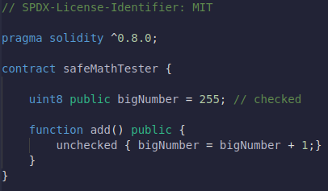

## Libraries

As bibliotecas são semelhantes aos contratos, mas sua finalidade é que sejam implantadas apenas uma vez em um endereço específico e seu código seja reutilizado.

Usando palavra-chave: A diretiva usando A para B; pode ser usado para anexar funções de biblioteca (da biblioteca A) a qualquer tipo (B) no contexto de um contrato.

Nesse caso, estamos anexando uma biblioteca de chainlink SafeMath ao uint256 para que esses overflows sejam verificados automaticamente.

Isto é para aqueles de vocês que estão familiarizados com SafeMath e estouros e underflows inteiros. Nós não vamos chamar as funções que SafeMath nos fornece como div, add, null todas essas funções. Simplesmente porque em 0.8 daqui para frente nós não temos que usar esses. Podemos apenas usar o operador regular como '+' e '-'.

## SafeMath & Integer Overflow

Safemath & Integer Overflow

Já que estamos no tópico de matemática, vamos falar brevemente sobre algumas das armadilhas do Solidity, especialmente quando se trata de matemática.

Antes do Solidity 0.8, se você adicionasse ao tamanho máximo, um número uint poderia ser agrupado ao redor do número mais baixo que seria. Por exemplo:

se adicionarmos dois números uint8 : 255 + uint8(1) = 0 255 + uint(1) = 1

Isso ocorre porque o número inteiro pode realmente se enrolar quando atingir seu limite máximo. Eles basicamente são redefinidos.

Isso é algo que precisamos observar ao trabalhar com solidez. Se estivermos fazendo multiplicação em números muito grandes, podemos acidentalmente passar esse limite. Felizmente, como uma versão 0.8 do Solidity, ele verifica o Ovverflow e o padrão é verificar estouro para aumentar a legibilidade do código mesmo que venha um ligeiro aumento dos custos de gás.

Apenas esteja ciente de que se você estiver usando uma versão inferior que 0.8 você terá que fazer algo para compensar isso.

Poderíamos escrever um monte de código para verificar toda a nossa matemática ou poderíamos simplesmente importar "SafeMath" de outro pacote. Semelhante ao chainlink, podemos importar o SafeMath da ferramenta chamada OpenZeppelin.

OpenZeppelin é uma ferramenta de código aberto que nos permite usar muitos contratos pré-construídos.

## Definindo Limite

